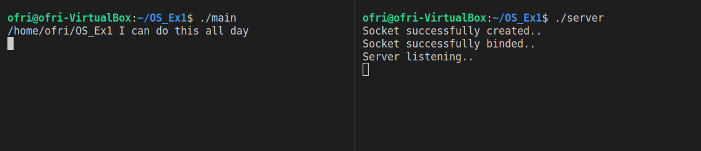
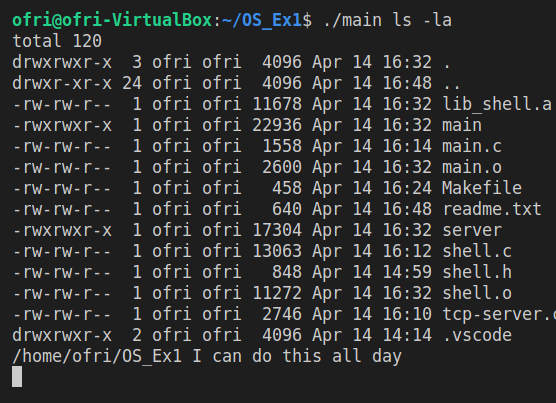
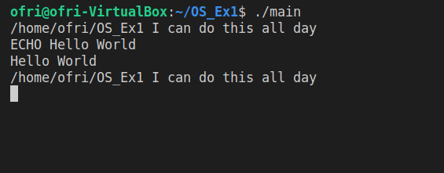
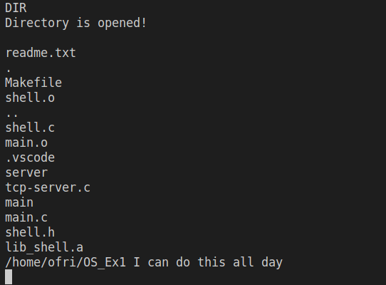
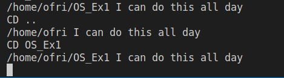
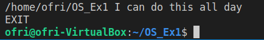

# Operational Systems Assignment 1 - Linux Shell
By Ofri Tavor and Almog David

## Credits:
We used the implementation of TCP server and client we took from Geeks For Geeks and adapt it
to our needs, in the documentation we explained where we used it and what changes we made.

## How to run:
1. Enter "make all" in the terminal
2. Open another terminal
3. Enter "./main" in the first terminal in order to run the shell
4. Enter "./server" in the second terminal in order to run the TCP server

## How to remove the files:
Enter "make clean" in the terminal

## Answers:
Answers for the Questions are inside the documentation of the code in the needed place

## Examples of the running code:
### Running the code

We can also see the promt "I can do this all day", a quote from the first Captain America movie, and the path.

### Arguments handling

### Echo command handling

### Handling TCP PORT command
#### Connection accepted 

#### Using ECHO command with connection open

### Handling Local command

### Handling DIR command

### Handling CD command

### Handling COPY  and DELETE commands

### Handling any other commands

### Handling EXIT command

